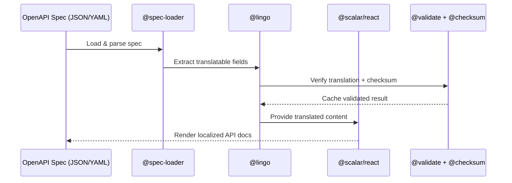

# Scalang

Multilingual OpenAPI documentation powered by [Scalar](https://scalar.com) and [Lingo.dev](https://lingo.dev).

Scalang takes your OpenAPI spec, translates it into multiple languages using Lingo.dev's AI translation engine, and serves beautiful API documentation with Scalar — complete with language switching, smart caching, and spec verification.

## Quick Start

```bash
npx @scalang/cli create my-api-docs
```

This scaffolds a complete Next.js project with:

- Translated OpenAPI specs for your chosen languages
- Scalar-powered API reference UI with a language selector
- Smart checksum-based caching for incremental regeneration
- Spec verification with auto-fix capabilities

## Packages

| Package                                        | Description                                                       | npm                                                                                                             |
| ---------------------------------------------- | ----------------------------------------------------------------- | --------------------------------------------------------------------------------------------------------------- |
| [`@scalang/cli`](packages/cli)                 | CLI to scaffold projects and generate/verify translated specs     | [](https://www.npmjs.com/package/@scalang/cli)                 |
| [`@scalang/react`](packages/react)             | React components with language selector for Scalar API reference  | [](https://www.npmjs.com/package/@scalang/react)             |
| [`@scalang/schema`](packages/schema)           | Configuration schema, types, and validation                       | [](https://www.npmjs.com/package/@scalang/schema)           |
| [`@scalang/spec-loader`](packages/spec-loader) | OpenAPI spec parser, field extractor, and translation injector    | [](https://www.npmjs.com/package/@scalang/spec-loader) |
| [`@scalang/lingo`](packages/lingo)             | Lingo.dev translation engine wrapper                              | [](https://www.npmjs.com/package/@scalang/lingo)             |
| [`@scalang/checksum`](packages/checksum)       | Checksum-based caching and generation state management            | [](https://www.npmjs.com/package/@scalang/checksum)       |
| [`@scalang/validate`](packages/validate)       | Spec verification, identifier preservation, and English detection | [](https://www.npmjs.com/package/@scalang/validate)       |

## How It Works



1. **Parse** — `@scalang/spec-loader` loads your OpenAPI spec from a file or URL
2. **Extract** — Translatable fields (descriptions, summaries, titles) are extracted based on your config
3. **Translate** — `@scalang/lingo` sends extracted strings to Lingo.dev in batches
4. **Inject** — Translated strings are injected back into cloned specs, one per locale
5. **Verify** — `@scalang/validate` checks structural integrity, identifier preservation, and translation completeness
6. **Cache** — `@scalang/checksum` tracks source/config checksums to skip unnecessary regeneration
7. **Serve** — `@scalang/react` renders the Scalar API reference with a language selector bar

## Usage

### Generate Translated Specs

```bash
# Inside a scaffolded project
npm run generate

# Force regeneration (skip cache)
npm run generate:force
```

### Verify Specs

```bash
# Check for issues
npm run verify

# Auto-fix identifier issues
npm run verify:fix

# Fix + retranslate missing translations
npm run verify:retranslate
```

### Configuration

Create a `.scalang-config` file in your project root:

```json
{
  "source": "./specs/openapi.json",
  "sourceLocale": "en",
  "targetLocales": ["fr", "de", "es", "ja"],
  "defaultLocale": "en",
  "translatableFields": [
    {
      "name": "info",
      "enabled": true,
      "fields": ["info.title", "info.description"]
    },
    {
      "name": "operations",
      "enabled": true,
      "fields": ["paths.*.*.summary", "paths.*.*.description"]
    },
    {
      "name": "schemas",
      "enabled": true,
      "fields": ["components.schemas.*.description"]
    }
  ],
  "scalar": {
    "theme": "default",
    "layout": "modern",
    "darkMode": true
  }
}
```

### Environment Variables

| Variable              | Description                               |
| --------------------- | ----------------------------------------- |
| `LINGODOTDEV_API_KEY` | API key for Lingo.dev translation service |

## Development

This is a [Turborepo](https://turbo.build) monorepo using [Bun](https://bun.sh) as the package manager.

```bash
# Install dependencies
bun install

# Build all packages
bun run build

# Run dev servers
bun run dev

# Type checking
bun run typecheck

# Lint
bun run lint

# Run tests
bun test
```

## Monorepo Structure

```
scalang/
├── apps/
│   ├── template/        # Next.js template (bundled with CLI)
│   └── web/             # Main website
├── packages/
│   ├── schema/          # Config types, validation, constants
│   ├── spec-loader/     # OpenAPI parsing & field extraction
│   ├── lingo/           # Lingo.dev translation wrapper
│   ├── checksum/        # SHA-256 caching & state management
│   ├── validate/        # Spec verification & repair
│   ├── react/           # React components & language selector
│   ├── cli/             # CLI tool (scalang command)
│   ├── eslint-config/   # Shared ESLint configurations
│   ├── typescript-config/ # Shared TypeScript configurations
│   └── ui/              # Shared UI components
└── tests/               # Integration tests
```

## License

MIT
